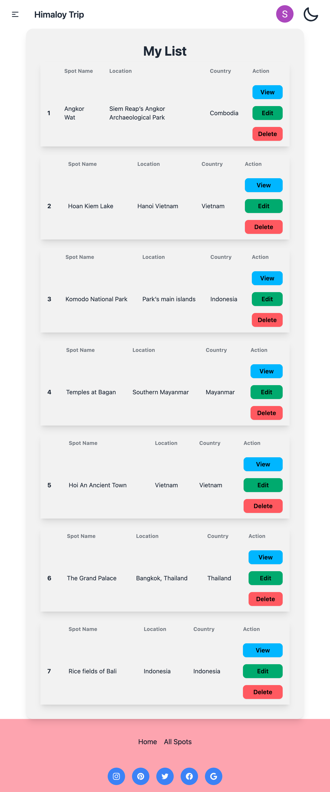

# Himaloy Estate [Live Preview](https://himaloytrip.web.app/)
## Website Features

- User-friendly interface: Our website provides a clean and intuitive interface.

- Light/Dark theme.

- Responsive design: The website is designed to be responsive, ensuring that it looks great and functions well on different devices and screen sizes.

- Interactive elements: We have incorporated interactive elements such as forms, buttons, and sliders to enhance user engagement and interactivity.

- Unique Design: Our website stands out with its unique and visually appealing design, setting it apart from competitors.

- Login / Register: We have implemented a secure login and registration system, allowing users to create accounts and access personalized features.
  - Email and Password: Users can securely log in to their accounts using their email and password credentials.
  - Google Login: Users can also log in to their accounts using their Google credentials, providing a convenient and seamless login experience.

# Features
- Signed In user can show a Single spot
- A registered User can Add a new spot
- Authorized user can edit/update and delete spot

## npm package name which I have used:
React, Vite, React-simple-tyepwriter, Lottie React, Swiper, Sweetalert and more
- React: React for building the user interface
- Vite: Vite for the build tool and development server
- React-simple-typewriter:A simple react component for adding a nice typewriter effect to your project.
- Swiper: Swiper is a powerful and flexible JavaScript library for creating responsive and touch-enabled sliders and carousels.
Sweetalert:
- Sweetalert: Sweetalert is a JavaScript library for creating beautiful and customizable alert dialogs.
- And Tailwind CSS, DaisyUI...

### Screenshoots
# Home - Light

# Home - Dark

# My List - Small Device

